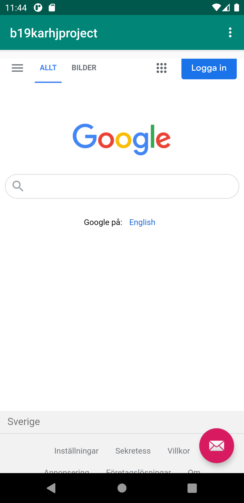
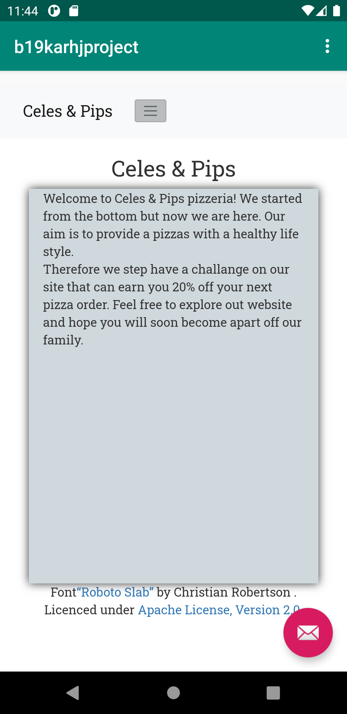

# Rapport Dugga2

I dugga2 så har jag skapat en webläsare för applikationen.
Första steget var att forka den färdiga templaten från github och sedan klona den till andriod studios.

Andra steget var att döpa om namnet på applikationen, detta görs i stings.xml filen. Jag döpte namnet på applikationen
till b19karhjproject.
```
   <string name="app_name">b19karhjproject</string>
```

Sedan laddes koden:

```
<uses-permission android:name="android.permission.INTERNET" />
```

in i AndroidManifest.xml för att webviewn skulle få internetåtkomst.
Samtidigt som koden:

```
 android:id="@+id/my_webview"
 ```
 för att ge ett id till webview.

 ```
 <WebView
         android:id="@+id/my_webview"
         android:layout_width="match_parent"
         android:layout_height="match_parent"
         android:layout_marginTop="70dp"
         app:layout_constraintBottom_toBottomOf="parent" />
 ```
 Lades in i content.main för att skapa ett webview element.

 För att enable javascript exikuvering för applikationen så applikationen kan exukivera javascript kod.
 Koden lades in i MainActivity

 ```
         WebSettings webSettings = myWebView.getSettings();
         webSettings.setJavaScriptEnabled(true);
 ```
 Jag har sedan skapat en html fil i assets som jag har som min interna websida.
 Jag har döpt filen till First.html, igentligen behöver den inte heta .html eftersom valet av vilken filtyp
 som filen ska ha gör man i stegen vid skapandet av filen.

 Koden:

 ```
 myWebView.loadUrl("File:///android_asset/First.html");
 ```

 lades in i showInternalWebPage funktionen så att den öppnar sidan när internalWebPage funktionen aktiveras.
 Men det gick inte helt felfritt för att koden.

 ```
 WebView myWebView = findViewById(R.id.my_webview);
 ```
 Måste också in i funktionen så att Webvien vet att den skall öppna filen med våran tidigare skapade webView.

 Här är en bil på min externa webplats google.com

 

 Och min interna webplats.

  


_Du kan ta bort all text som finns sedan tidigare_.

## Följande grundsyn gäller dugga-svar:

- Ett kortfattat svar är att föredra. Svar som är längre än en sida text (skärmdumpar och programkod exkluderat) är onödigt långt.
- Svaret skall ha minst en snutt programkod.
- Svaret skall inkludera en kort övergripande förklarande text som redogör för vad respektive snutt programkod gör eller som svarar på annan teorifråga.
- Svaret skall ha minst en skärmdump. Skärmdumpar skall illustrera exekvering av relevant programkod. Eventuell text i skärmdumpar måste vara läsbar.
- I de fall detta efterfrågas, dela upp delar av ditt svar i för- och nackdelar. Dina för- respektive nackdelar skall vara i form av punktlistor med kortare stycken (3-4 meningar).

Programkod ska se ut som exemplet nedan. Koden måste vara korrekt indenterad då den blir lättare att läsa vilket gör det lättare att hitta syntaktiska fel.

```
function errorCallback(error) {
    switch(error.code) {
        case error.PERMISSION_DENIED:
            // Geolocation API stöds inte, gör något
            break;
        case error.POSITION_UNAVAILABLE:
            // Misslyckat positionsanrop, gör något
            break;
        case error.UNKNOWN_ERROR:
            // Okänt fel, gör något
            break;
    }
}
```

Bilder läggs i samma mapp som markdown-filen.


Läs gärna:

- Boulos, M.N.K., Warren, J., Gong, J. & Yue, P. (2010) Web GIS in practice VIII: HTML5 and the canvas element for interactive online mapping. International journal of health geographics 9, 14. Shin, Y. &
- Wunsche, B.C. (2013) A smartphone-based golf simulation exercise game for supporting arthritis patients. 2013 28th International Conference of Image and Vision Computing New Zealand (IVCNZ), IEEE, pp. 459–464.
- Wohlin, C., Runeson, P., Höst, M., Ohlsson, M.C., Regnell, B., Wesslén, A. (2012) Experimentation in Software Engineering, Berlin, Heidelberg: Springer Berlin Heidelberg.
